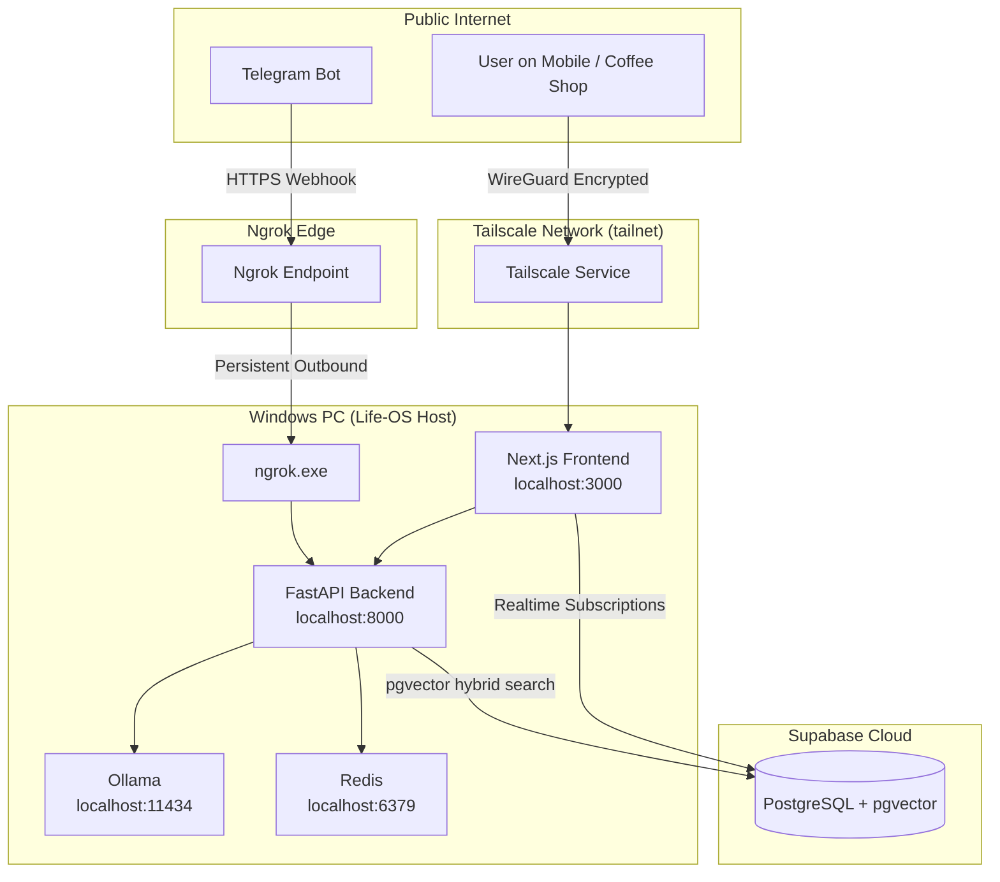
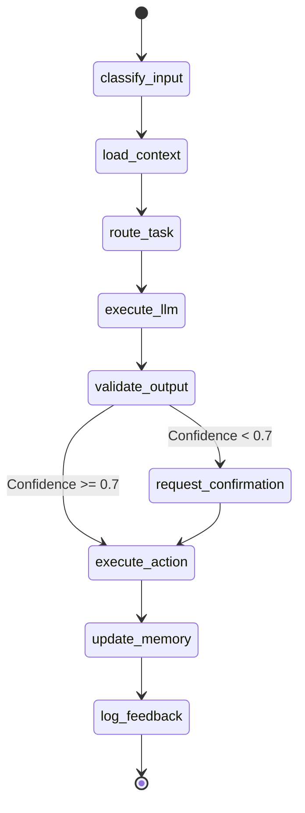

# Life-OS Architecture

This document describes the system architecture for Life-OS, a personal digital twin running locally on Windows.

## System Topology & Networking

The system uses a hybrid networking approach:
- **Ngrok** for exposing the Telegram Webhook securely without inbound port forwarding (using their free static domain feature).
- **Tailscale** for private, encrypted access to the web dashboard.



## LangGraph State Machine



## Configuration (`config.yaml`)

```yaml
# Life-OS Configuration
system:
  name: "Life-OS"
  timezone: "America/New_York"
  
routing:
  default_model: "openrouter/openai/gpt-3.5-turbo"
  local_models:
    health_private: "llama3.1:8b"
    quick_queries: "mistral:7b"
  
  openrouter_models:
    deep_reasoning: "anthropic/claude-3.5-sonnet"
    vision: "openai/gpt-4o-mini"
    fast_chat: "google/gemini-1.5-flash"
  
schedules:
  morning_briefing: "07:00"
  health_sync: "23:30"
  finance_sync: "02:00"
  
privacy:
  local_only_domains:
    - "symptoms"
    - "sleep_analysis"
    - "stress_detection"
  
notifications:
  telegram_enabled: true
  dashboard_enabled: true
  
features:
  web_dashboard: true
  voice_logging: true
  vision_meals: true
  workout_tracking: true
  finance: true
  automations: true
  calendar: true
```

## Environment Variables (`.env`)

```env
# OpenRouter (one API for all models)
OPENROUTER_API_KEY=sk-or-v1-...

# Supabase (cloud DB - using pgvector)
SUPABASE_URL=https://your-project.supabase.co
SUPABASE_SERVICE_KEY=eyJ...

# Telegram Bot
TELEGRAM_BOT_TOKEN=123456:ABC-DEF

# Ngrok Configuration
NGROK_AUTHTOKEN=your_ngrok_token
NGROK_DOMAIN=your-static-domain.ngrok-free.app

# Finance (PDF Ingestion)
STATEMENT_DIRECTORY=./data/statements
FINNHUB_API_KEY=...

# Xiaomi Mi Fitness (For Sleep and Workout Data)
XIAOMI_EMAIL=your_email@gmail.com
XIAOMI_PASSWORD=your_password
XIAOMI_REGION=eu

# Optional: Self-hosted or free
OLLAMA_HOST=http://localhost:11434

# Supabase Auth for Dashboard
NEXT_PUBLIC_SUPABASE_URL=https://your-project.supabase.co
NEXT_PUBLIC_SUPABASE_ANON_KEY=eyJ...
```
